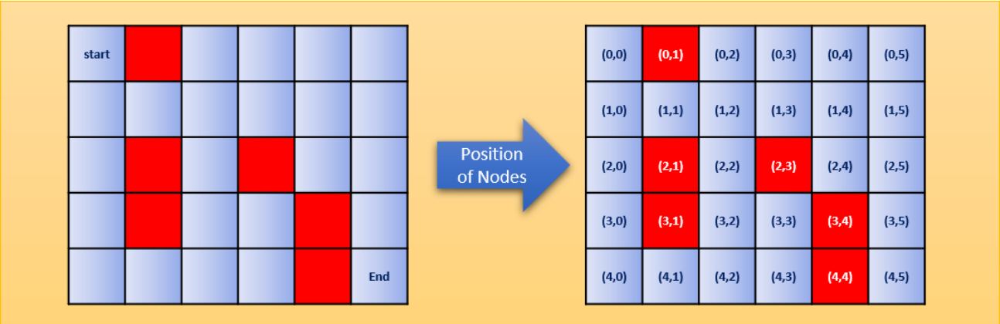
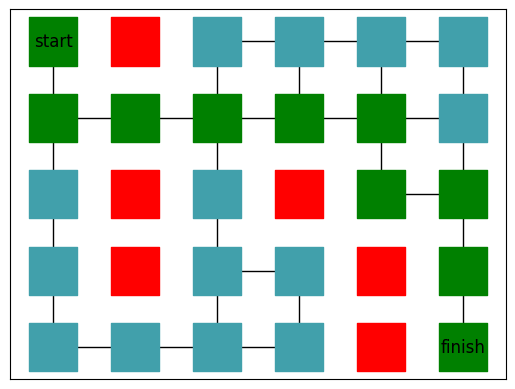

# A-Star (A*) Algorithm
Python code that implements the A* algorithm.
This source takes a grid mxn with a specified walkable path and shows the shortest path from the start to the finish (if possible).

